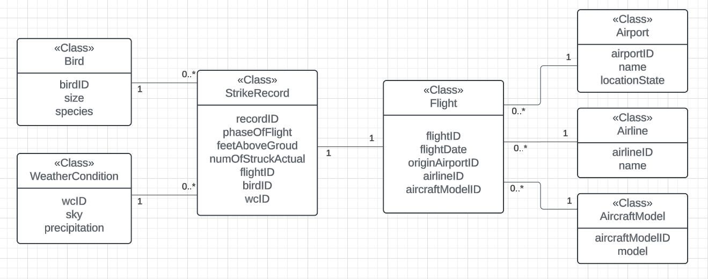
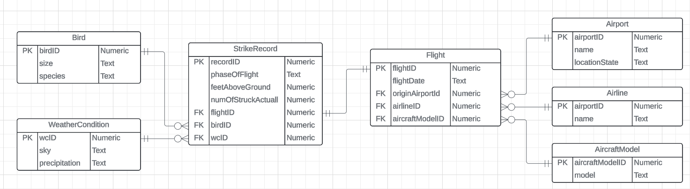
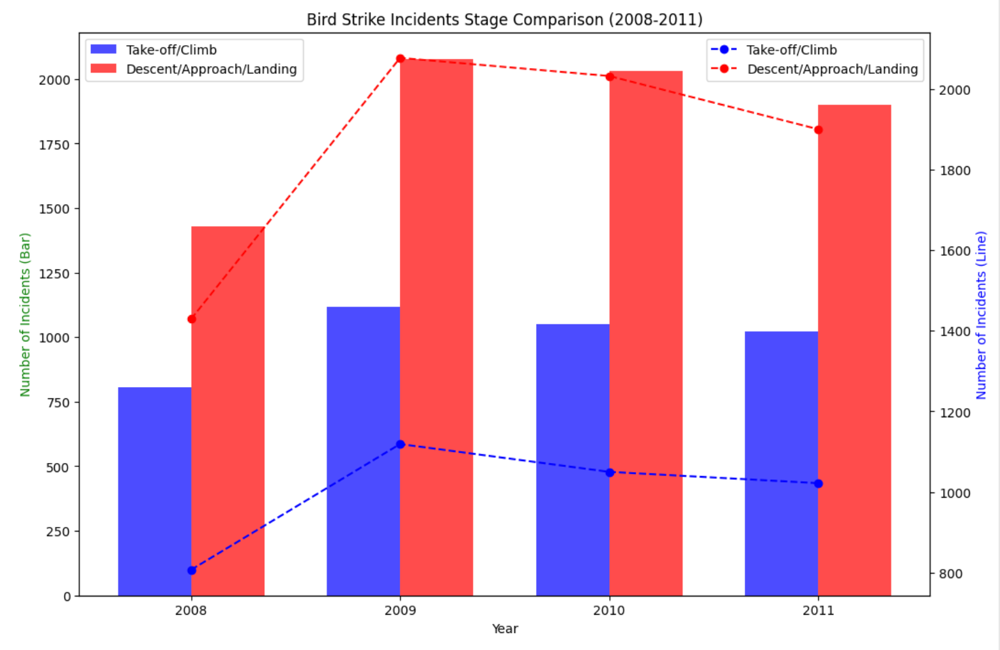
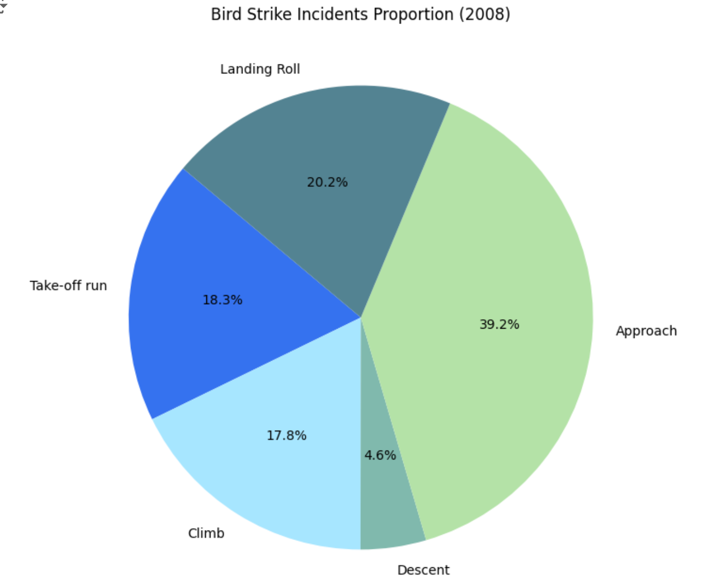
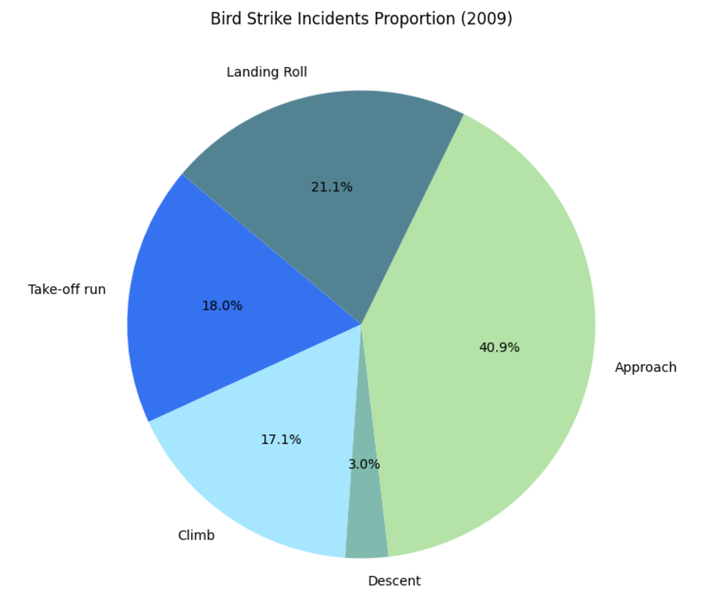
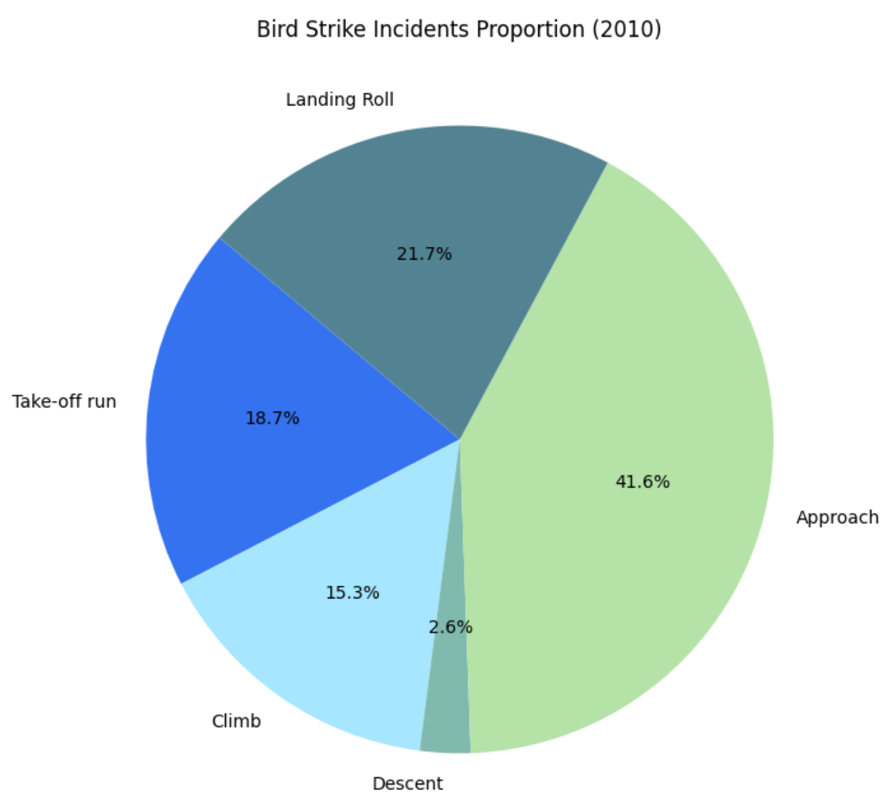
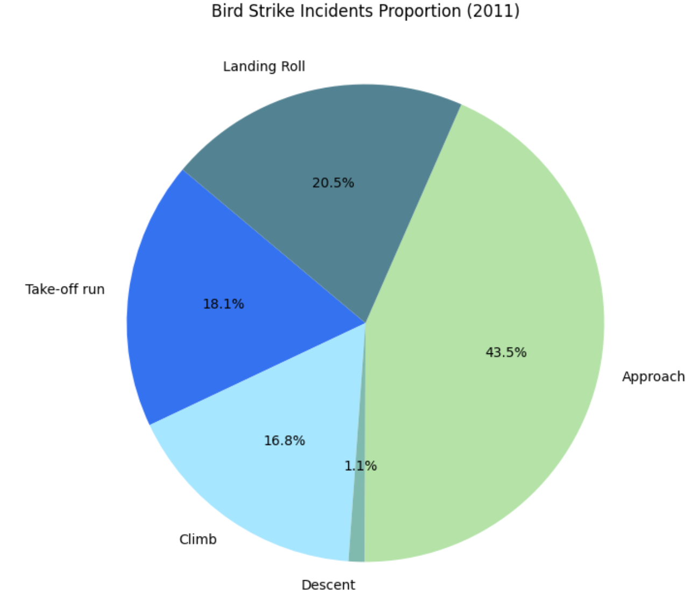

# CS5200_Project_1
 
# Bird Strike Incidents Database Project

## Project Overview

This project involves designing and implementing a database to help America's Federal Aviation Authority (FAA) organize and analyze bird-strike incidents data. The database will assist pilots in recording and analyzing data related to incidents where birds have collided with planes. The project includes several stages from conceptual modeling to presenting results through queries and visualizations.

## Project Requirements

### Scenario
The FAA needs a database to track bird-strike incidents, including details such as:
- Incident date and time
- Number of birds involved
- Flight phase and altitude during the incident
- Airport and state
- Aircraft and airline details
- Weather and precipitation during the incident
- Bird species involved

### Parts of the Project

#### Part 1: Conceptual Modeling 
- Create a UML Class Diagram using Lucid or another design tool.
- Include all necessary entities, attributes, and relationships with multiplicities and labels.

#### UML Class Diagram

#### Part 2: Logical Modeling 
- Convert the UML Class Diagram into a Relational Schema.
- Mark primary and foreign keys, create junction tables as needed, and specify data types.

#### Relational Schema

#### Part 3: Database Realization 
- Implement the Relational Schema in a SQLite database using Jupyter Notebook.
- Include CREATE TABLE statements with relevant constraints and behaviors for foreign keys.

#### Part 4: Load and Clean Data 
- Programmatically load the provided bird-strike data .csv into the database.
- Clean the data by handling anomalies, null values, and converting data types as needed.

#### Part 5: Queries 
Provide SQL queries to answer the following questions:
1. Number of bird strike incidents for each airline during take-off or climb.
2. Airport with the most birds involved in incidents.
3. Number of bird strike incidents by year.

#### Part 6: Present Results
- Create a column chart visualizing the number of bird strike incidents per year (2008-2011) during take-off/climbing and descent/approach/landing.
- Provide axis labels, titles, legend, data labels, and a conclusion about any observed trends.

